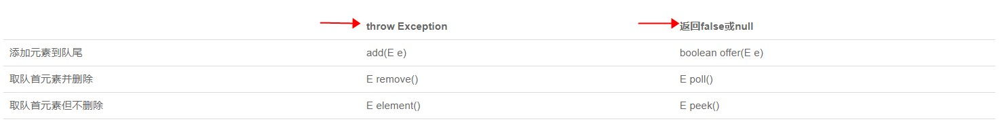

### 数据结构学习内容
- 一维：
  * 基础：数组(array、string), 链表(linkedList);
  * 高级：栈(stack)、队列(queue)、双端队列(deque)、集合(set)、映射(Hash、Map);
- 二维：
  * 基础：树(tree)、图(graph);
  * 高级：字典树(trie)、二叉搜索树(BinarySearch Tree){红黑树、AVL}、堆(heap)、并查集(disjoint set);
- 特殊：
位运算、布隆过滤器、LRU cache
### 算法的时间复杂度和空间复杂度
- 常见的算法时间复杂度(从低到高排序)：O(1)、O(logN)、O(n)、O(n^2)、O(n^3)、O(2^n)、O(n!)
- 空间复杂度比较常用的有：O(1)、O(n)、O(n²)
----------------------------------------------------------------------------
#### 一、数组、链表、跳表
 1. 操作的时间复杂度：
    - 数组：插入、删除, 要对数组的部分元素进行移动，所以时间复杂度为 O(n);  
    查找,数组通过系统的内存管理器直接对数组元素进行访问，时间复杂度为O(1)。
    - 链表：插入、删除, 直接改变前后元素的指针方向, 时间复杂度为O(1); 
    查找, 必须要从头开始循环查找到目标元素, 时间复杂度为O(n)。
    - 跳表：用另外的表进行数组元素索引的建立,将一维的数据结构变为二维。增删查的时间复杂度皆为O(logN),
    由于效率高，所以redis用跳表来代替树。
 2. 例题：package array and linklist
#### 二、栈、队列、双端队列、优先队列
1. 操作的时间复杂度：
    - 栈(stack)： 存入(push)、弹出(pop)、查看栈顶元素(peek)，O(1)；寻找特定数值的位置，O(n)。
    - 队列(queue)：队尾添加、队头移除、队头获取的时间复杂度皆为O(1)。
    - 双端队列(deque)：队头和队尾添加、移除和获取的时间复杂度都为O(1)。
    - 优先队列(PriorityQueue)：插入为O(1),因为有优先级算法所以取出时的时间复杂度为O(n),底层实现为堆(heap)或二叉搜索树(bst)
2. Deque操作的实例代码: class que.DequeTest
3. 分析 Queue 和 Priority Queue 的源码：
    - Queue的源码分析：
    
    - PriorityQueue的源码分析：
      * 1.PriorityQueue和Queue的区别在于，它的出队顺序与元素的优先级有关，对PriorityQueue调用remove()或poll()方法，返回的总是优先级最高的元素。
          要使用PriorityQueue，我们就必须给每个元素定义“优先级”。
      * 2.Java对于优先级的实现是通过Comparable接口实现的。传入PriorityQueue的对象实现Comparable接口，在offer对象的时候会对象按照compare方法的规则
          进行排序，从而实现优先级队列。
#### HashMap的源码分析：
https://blog.csdn.net/qq_39899425/article/details/107223882

